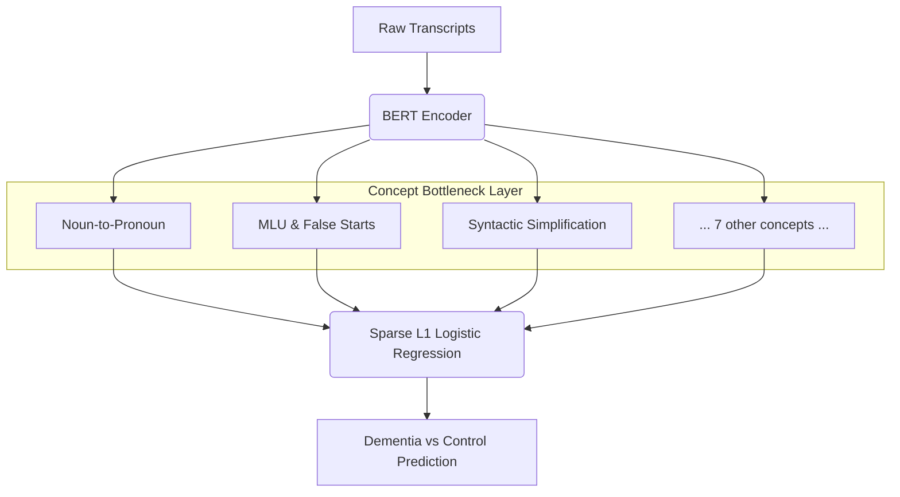

# Concept Bottleneck Model (CBM) Pipeline for Dementia Detection

This document outlines the end-to-end pipeline for training and evaluating an interpretable Concept Bottleneck Model (CBM) designed to detect dementia from spoken transcripts (Cookie Theft picture description task). 

Unlike standard "black-box" neural networks, this CBM forces the model to make predictions strictly based on predefined, clinician-understandable linguistic concepts.

---

## Architecture Overview



---

## Step 1: Defining Clinical Concepts & Mini-Datasets
*(File: `cav/concepts.py`)*

The pipeline begins by defining **10 specific linguistic markers** of dementia (e.g., *Noun-to-Pronoun Ratio*, *Semantic Paraphasias*, *Information Content Units*). 
Because we do not have token-level annotations for these concepts in the main dataset, we synthesize **Mini-Datasets**.
* For each concept, we generate 30 "Positive" examples (where the concept is highly present) and 30 "Negative" examples (healthy, descriptive speech).
* Weak labeling functions are defined as a proxy to measure these concepts programmatically (e.g., regex to count pauses or pronouns).

## Step 2: Training Concept Activation Vectors (CAVs)
*(Files: `cav/embed.py`, `cav/train.py`, `run_cav_pipeline.py`)*

We extract the semantic direction of each concept from the hidden space of a pre-trained language model (`bert-base-uncased`).
1. **Embedding:** The mini-datasets are passed through BERT. The hidden states for every token are extracted.
2. **Layer Selection:** For each concept, we extract token embeddings from deeper layers (Layers 7 through 11).
3. **SVM Training:** We train a linear Support Vector Machine (LinearSVC) on the token embeddings to separate the positive examples from the negative examples. 
4. **CAV Extraction:** The SVM that achieves the highest Cross-Validation (CV) accuracy across the layers is selected. The vector orthogonal to this SVM's decision boundary becomes our **Concept Activation Vector (CAV)**.

## Step 3: Building the Concept Bottleneck Matrix
*(Files: `cav/score.py`, `run_cav_pipeline.py`)*

Once the CAV probes are trained, we process the actual DementiaBank transcripts.
1. Each transcript is passed through BERT.
2. We extract the token embeddings at the specific layer chosen for a given concept.
3. The token embeddings are projected onto the CAV. 
4. The token-level scores are averaged (mean-pooled) to calculate a **single continuous score** representing how strongly that clinical concept is present in the entire transcript.
5. This process is repeated for all 10 concepts across all transcripts, resulting in a `(N_transcripts, 10)` **Bottleneck Matrix** (`bottleneck_matrix.npy`).

## Step 4: Concept Validation
*(Files: `cav/validate.py`, `outputs/cav/validation_report.md`)*

Before trusting the bottleneck matrix, we validate the extracted concept scores against our programmatic weak labels. 
* We calculate the **Pearson correlation** between the CBM's neural concept scores and the weak label proxy scores across the training set. 
* High positive correlations confirm that the CAVs are accurately measuring the intended linguistic phenomena in the wild, without requiring manual annotations.

## Step 5: Training the Final Classifier
*(File: `train_cbm.py`)*

The final classifier makes the diagnosis (Dementia vs. Control) using *only* the 10 concept scores as input features.
* We train a **Logistic Regression** model using an **L1 Penalty** (Lasso regularization).
* The L1 penalty acts as a feature selector, aggressively pushing the weights of uninformative or redundant concepts to exactly `0.0`. 
* **Interpretability:** The resulting model is highly transparent. For any given prediction, we can calculate the exact impact of each clinical concept by taking the product of the concept score and its learned weight.

## Step 6: Interactive Explanations and Token Heatmaps
*(File: `gradio_cbm_explorer.py`)*

To make the system useful for clinicians, we provide an interactive web interface.
1. **Global Explanation:** Selecting a transcript outputs the model's prediction and a sorted table of the contributing concepts and their specific impact scores.
2. **Local Explanation (Heatmaps):** Because the CAVs exist in the exact same dimensional space as BERT's token embeddings, we can project individual words onto the concept vector. 
3. **Visualization:** Clicking a concept instantly renders a heatmap over the transcript. Tokens that project strongly in the positive direction of the CAV are highlighted in **red**, while negative projections are highlighted in **blue**, allowing the user to precisely see *where* in the transcript the model detected the clinical marker.

---

### Pipeline Execution Commands

**1. Run the CAV extraction and Bottleneck Generation:**
```bash
python run_cav_pipeline.py
```

**2. Train the Sparse Classifier and view global metrics:**
```bash
python train_cbm.py
```

**3. Launch the Interactive Visualizer:**
```bash
python gradio_cbm_explorer.py
```
